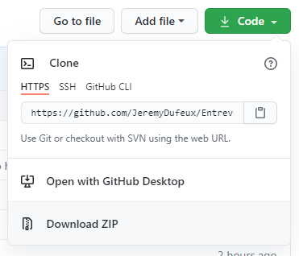
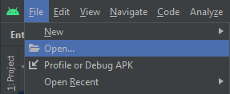
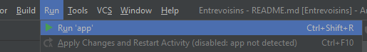

# Entrevoisin

Ce dépôt contient l'application **Entrevoisin** pour le P3 du parcours **Parcours développeur d'application - Android** d'OpenClassrooms.

# Installation

Cliquer sur le bouton vert **Code** en haut à droite , puis **Downoad ZIP**.

Décomprésser l'archive sur l'ordinateur.

Depuis **Android Studio** , cliquer sur **File**, **Open...**, et aller chercher le dossier contenant les fichiers décompréssés et cliquer sur **OK**.

# Exécution

Cliquer sur **Run** et **Run 'App'** pour compiler et exécuter l'application.

